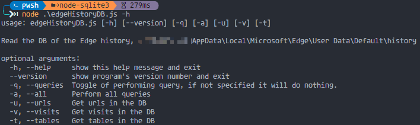

# Sqlite3 with node operation

The project shows how to read the sqlite3 database using the node.js.

The program is easy to understand with parseArgs module.

---

## Edge history DB

It takes the example of reading Edge explorer history database.

---

## Any given DB

It also allows the user read any database,
all it needs is the file path.

